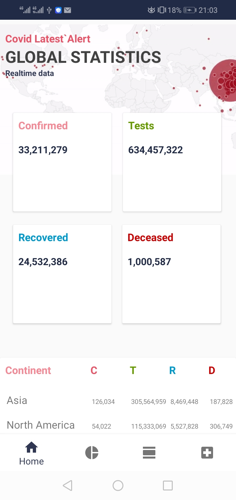

# Covid-19 Alert Application
This application gives a realtime statistics on the Novel Corona Virus. The data is realtime.
The data API is (https://corona.lmao.ninja/v2/)

### Library reference resources:
1. RxJava2: https://github.com/amitshekhariitbhu/RxJava2-Android-Samples
2. Dagger2: https://github.com/MindorksOpenSource/android-dagger2-example
3. FastAndroidNetworking: https://github.com/amitshekhariitbhu/Fast-Android-Networking

### Required Dependencies

        implementation 'com.squareup.retrofit2:retrofit:2.8.1'
        implementation 'com.squareup.retrofit2:converter-gson:2.8.1'
        implementation 'com.squareup.retrofit2:adapter-rxjava2:2.8.1'
        implementation 'com.squareup.okhttp3:logging-interceptor:4.5.0'
        implementation "androidx.lifecycle:lifecycle-viewmodel:2.2.0"
        implementation "android.arch.lifecycle:runtime:1.1.1"
        implementation "android.arch.lifecycle:extensions:1.1.1"
        annotationProcessor "android.arch.lifecycle:compiler:1.1.1"
        implementation 'com.github.bumptech.glide:glide:4.11.0'

        //gif
        implementation 'pl.droidsonroids.gif:android-gif-drawable:1.2.18'

        //Dagger Dependency
        def dagger = "2.27"
        implementation "com.google.dagger:dagger-android:$dagger"
        api "com.google.dagger:dagger-android-support:$dagger" // if you use the support libraries
        annotationProcessor "com.google.dagger:dagger-compiler:$dagger"

        def lifecycle_version = "2.2.0"

        // LiveData
        implementation "androidx.lifecycle:lifecycle-livedata:$lifecycle_version"
        //rxjava
        def rxandroid = "2.1.1"
        def rxjava = "2.2.16"
        implementation "io.reactivex.rxjava2:rxandroid:$rxandroid"
        // Because RxAndroid releases are few and far between, it is recommended you also
        // explicitly depend on RxJava's latest version for bug fixes and new features.
        // (see https://github.com/ReactiveX/RxJava/releases for latest 3.x.x version)
        implementation "io.reactivex.rxjava2:rxjava:$rxjava"

### App UI
  
  
  
  

